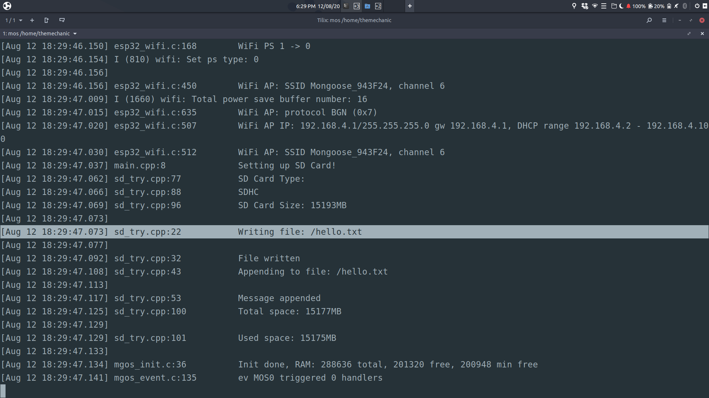

# Running CAN Bus library from Arduino on ESP32 running Mongoose OS

[Arduino library used](https://github.com/Seeed-Studio/CAN_BUS_Shield)

This mongoose os app does not use the arduino-compat library provided by Mongoose OS. Instead, the source files, header files and static library files have been added from esp32-arduino project directly.

This application makes use of arduino port that was used to [sdcard library](https://github.com/meticulousCraftman/mgos-sdcard-port).


## Build command

```console
foo@bar:~$ mos build --platform esp32 --local --verbose --no-libs-update --binary-libs-dir "binary_libs"
Local build starts...
Internet connection to fetch new packages
```

## Flash

```console
foo@bar:~$ mos flash esp32 --port /dev/ttyUSB0 build/fw.zip
```

## Running
Watch the application write data to a file named **hello.txt**.
```console
foo@bar:~$ mos console --port /dev/ttyUSB0
```




## Output
This is RX code. Setup an Arduino that continosuly transmits data on CAN lines. For more information see [this tutorial](https://www.electronicshub.org/arduino-mcp2515-can-bus-tutorial/)
